# HANILIE'S CAKESHOPPE EVENT MANAGEMENT PLATFORM

CAPSTONE MANUSCRIPT

Chapters I, II, III

---

# TABLE OF CONTENTS

CHAPTER 1: THE PROBLEM AND ITS BACKGROUND ........................................................ [page]
1.1 Introduction ................................................................................. [page]
1.2 Background of the Study ..................................................................... [page]
1.3 Statement of the Problem .................................................................... [page]
1.4 Objectives of the Study ..................................................................... [page]
1.5 Significance of the Study ................................................................... [page]
1.6 Scope and Delimitation ...................................................................... [page]
1.7 Conceptual Framework ......................................................................... [page]
1.8 Definition of Terms ......................................................................... [page]

CHAPTER 2: REVIEW OF RELATED LITERATURE AND SYSTEMS .............................................. [page]
2.1 Introduction ................................................................................. [page]
2.2 Related Literature ........................................................................... [page]
2.3 Related Systems .............................................................................. [page]
2.4 Synthesis of Literature and Research Gap .................................................... [page]
2.5 Theoretical and Technical Anchors of the Study .............................................. [page]
2.6 Conceptual Model of the Proposed System ...................................................... [page]
2.7 Chapter Summary .............................................................................. [page]

CHAPTER 3: METHODOLOGY ........................................................................... [page]
3.1 Introduction ................................................................................. [page]
3.2 Research Design .............................................................................. [page]
3.3 Development Methodology ...................................................................... [page]
3.3.1 Development Procedures ..................................................................... [page]
3.3.2 Development Phases ......................................................................... [page]
3.3.3 One-Page Visual Timeline (Gantt-Style) ..................................................... [page]
3.4 System Development Environment ............................................................... [page]
3.4.1 System Development Tools and Technologies ................................................... [page]
3.5 Requirements Engineering Procedure ........................................................... [page]
3.5.1 Requirements Analysis ...................................................................... [page]
3.6 System Architecture .......................................................................... [page]
3.6.1 Software Design ............................................................................ [page]
3.6.2 Products and Processes ...................................................................... [page]
3.6.3 Major Product Modules ....................................................................... [page]
3.7 Database and Data Model Design ............................................................... [page]
3.8 Operational Workflow Implementation ........................................................... [page]
3.9 Access Control and Security Controls ......................................................... [page]
3.10 Testing and Validation Strategy ............................................................. [page]
3.10.1 Testing Procedures ......................................................................... [page]
3.11 Deployment Method ............................................................................ [page]
3.12 Ethical Considerations and Data Handling ..................................................... [page]
3.13 Chapter Summary .............................................................................. [page]
3.14 Cost-Benefit Analysis (Philippine Peso) ..................................................... [page]
3.15 Required System Diagrams (Core) ............................................................. [page]
3.15.1 System Flowchart .......................................................................... [page]
3.15.2 Entity Relationship Diagram (ERD) ......................................................... [page]
3.15.3 IPO Diagram (Input-Process-Output) ........................................................ [page]
3.15.4 HIPO Diagram ............................................................................... [page]
3.15.5 Class Diagram .............................................................................. [page]
3.15.6 Use Case Diagram ........................................................................... [page]
3.15.7 System Architecture Diagram ................................................................. [page]
3.15.8 Block Diagram .............................................................................. [page]
3.15.9 Data Flow Diagram (DFD) Level 0 ........................................................... [page]
3.15.10 Data Flow Diagram (DFD) Level 1 .......................................................... [page]
3.15.11 Sequence Diagram .......................................................................... [page]

REFERENCES (IEEE STYLE) .......................................................................... [page]

# LIST OF FIGURES

Figure 3.1. System Flowchart of the Hanilie's Cakeshoppe Event Management and Ordering Platform .......... [page]
Figure 3.2. Entity Relationship Diagram (ERD) ........................................................ [page]
Figure 3.3. Input-Process-Output (IPO) Diagram ....................................................... [page]
Figure 3.4. HIPO Diagram ........................................................................ [page]
Figure 3.5. Class Diagram ....................................................................... [page]
Figure 3.6. Use Case Diagram .................................................................... [page]
Figure 3.7. System Architecture Diagram .......................................................... [page]
Figure 3.8. System Block Diagram ................................................................. [page]
Figure 3.9. Data Flow Diagram (DFD) Level 0 ..................................................... [page]
Figure 3.10. Data Flow Diagram (DFD) Level 1 .................................................... [page]
Figure 3.11. Sequence Diagram for Checkout-to-Payment Confirmation ................................. [page]

# LIST OF TABLES

Table 3.0. Functional Requirements Specification ................................................... [page]
Table 3.0.1. Non-Functional Requirements Specification .............................................. [page]
Table 3.0.2. Development Phases of the Study ....................................................... [page]
Table 3.0.3. Development Timeline (Six-Month Gantt-Style View) .................................... [page]
Table 3.0.4. System Development Tools and Technologies ............................................. [page]
Table 3.0.5. Major Product Modules ................................................................ [page]
Table 3.0.6. MoSCoW Prioritization of Functional Requirements ...................................... [page]
Table 3.1. Estimated One-Time and Annual Operating Costs ........................................... [page]
Table 3.2. Estimated Annual Benefits ............................................................... [page]
Table 3.3. ROI Summary ............................................................................. [page]

---

# CHAPTER 1

# THE PROBLEM AND ITS BACKGROUND

## 1.1 Introduction

Micro, small, and medium enterprises (MSMEs) in the food and events sector increasingly depend on digital platforms to improve customer service, order accuracy, and business continuity. Cakeshop businesses that offer customized event packages face a more complex operational environment than standard retail transactions because they manage time-bound bookings, delivery details, package inclusions, and payment confirmations in one service pipeline. Manual or semi-manual processing often causes delays, duplicate entries, and miscommunication between customers and managers.

Hanilie's Cakeshoppe addresses this operational challenge through the Hanilie's Cakeshoppe Event Management and Ordering Platform, a web-based information system developed using Django. The platform integrates customer registration, product browsing, package selection, cart and checkout processing, booking scheduling, payment confirmation, role-based access control, manager dashboard analytics, and notification/audit services. By integrating these modules in one workflow, the system aims to improve transaction integrity, reduce process friction, and strengthen customer experience.

The developed platform follows a structured order-to-payment lifecycle: package selection, checkout validation, order and booking creation, payment processing, status updates, and notification dispatch. This digital flow is aligned with software engineering principles on modularity, traceability, and iterative delivery [1], [2].

## 1.2 Background of the Study

The transition of local businesses from manual operations to platform-supported transactions has been accelerated by customer expectations for speed, transparency, and convenience. In event-related cake services, the customer does not only buy a product; they buy a schedule-dependent service package with multiple components and strict timing requirements. This makes the business process sensitive to errors in date handling, order details, and payment tracking.

Traditional approaches in small cake businesses typically use social media messaging, notebook logs, and spreadsheet-based tracking. While these methods are initially low-cost, they become inefficient when order volume grows. Common issues include:

1. Inconsistent recording of customer delivery information.
2. Weak visibility of order status for both customers and staff.
3. Delayed confirmation of payments.
4. Limited data for managerial monitoring and decision-making.
5. Difficulty in maintaining accountability when disputes arise.

To address these issues, the Hanilie's Cakeshoppe Event platform was developed as an integrated web application with:

1. Structured data entities for orders, bookings, and payments.
2. Status-controlled business logic (e.g., PENDING, CONFIRMED, CANCELLED, COMPLETED).
3. Customer notifications and audit logs for traceability.
4. Role-aware access controls for manager and customer operations.
5. Deployment-ready configuration for cloud hosting.

These design choices are consistent with best practices in web engineering and information systems where database-backed workflow automation improves service consistency and operational monitoring [1], [5], [6].

## 1.3 Statement of the Problem

Hanilie's Cakeshoppe requires an integrated platform that can manage event package orders, booking details, payment confirmation, and managerial monitoring without relying on disconnected manual records.

Specifically, this study seeks to answer the following questions:

1. How can a web-based system streamline the end-to-end process from package selection to payment confirmation for event-based cake orders?
2. How can the system enforce validation rules and data integrity for booking schedules, delivery profiles, and transaction status transitions?
3. How can role-based access controls be implemented to ensure that customers only access their own records while managers control operational pages?
4. How can notification and audit logging features improve transparency, accountability, and customer communication?
5. How can the developed platform support deployment and maintainability for real-world business use?

## 1.4 Objectives of the Study

### 1.4.1 General Objective

To design and develop a web-based Event Management and Ordering Platform for Hanilie's Cakeshoppe that automates customer ordering workflows, booking management, payment processing, and managerial monitoring.

### 1.4.2 Specific Objectives

1. To implement a customer-facing module for browsing cakes, event packages, customization options, and gallery content.
2. To implement a cart and checkout module that captures event date/time, venue, and delivery profile data before order confirmation.
3. To implement payment processing workflows that update booking and order statuses upon successful payment.
4. To implement role-based access controls and ownership checks for secure and correct data access.
5. To implement manager dashboard features for operational visibility, including order counts, revenue summaries, and recent transaction monitoring.
6. To implement notification and audit mechanisms for event traceability and user communication.
7. To prepare the system for cloud deployment with configurable environment-based settings.

## 1.5 Significance of the Study

The study is significant to the following stakeholders:

1. Hanilie's Cakeshoppe Management.
   The system provides centralized transaction records, operational dashboards, and traceable status updates, enabling improved business oversight.

2. Customers.
   The platform provides a clearer ordering experience, a more reliable booking and payment flow, and transparent status tracking.

3. Staff and Operations Personnel.
   Structured workflows reduce manual follow-up effort and minimize process ambiguity.

4. Future Researchers and Developers.
   The project serves as a practical reference for Django-based transactional systems in MSME settings, particularly in service-event commerce.

5. Academic Community.
   The capstone demonstrates how software engineering concepts can be applied to address a real local business problem.

## 1.6 Scope and Delimitation

### 1.6.1 Scope

The study covers the analysis, design, development, and initial validation of a web-based system with the following modules:

1. User account and role handling.
2. Product and package catalog management.
3. Cart management and checkout processing.
4. Booking creation with event schedule details.
5. Payment creation and status update flow.
6. Notification and audit logging.
7. Manager dashboard and order status administration.
8. Deployment configuration for a cloud-hosted environment.

### 1.6.2 Delimitation

1. Payment processing supports declared payment methods and records payment as system-validated state transitions, but does not implement direct third-party payment gateway API settlement.
2. The platform is designed for Hanilie's Cakeshoppe's current business model and data fields.
3. Advanced predictive AI is not implemented; recommendation behavior is rule-based by seasonal tags and month occasions.
4. The study focuses on software build and functional validation, not long-term financial impact analytics.

## 1.7 Conceptual Framework

The study adopts an Input-Process-Output (IPO) framework.

Input:

1. Business requirements (customer ordering, booking, payment, manager monitoring).
2. Technical stack (Django, PostgreSQL, Bootstrap, cloud deployment tools).
3. Access control and validation requirements.

Process:

1. Requirements analysis and feature decomposition.
2. Agile iterative development per module.
3. Data modeling and migration.
4. Implementation of workflows (cart -> checkout -> payment -> status update).
5. Functional and workflow testing.
6. Deployment preparation and environment configuration.

Output:

1. Deployed-ready Hanilie's Cakeshoppe Event Management and Ordering Platform.
2. Improved operational traceability through notifications and audit logs.
3. Centralized and role-aware transaction management.

## 1.8 Definition of Terms

1. Booking.
   A schedule-bound record linked to an order containing event date, time, venue, and delivery snapshot details.

2. Cart Item.
   A temporary customer-selected item (package/cake/customization) with quantity and computed unit pricing used before checkout confirmation.

3. Role-Based Access Control (RBAC).
   An authorization strategy where system privileges are granted based on user roles such as Manager or Customer [8].

4. Order Status Lifecycle.
   A controlled sequence of order states (e.g., PENDING, CONFIRMED, CANCELLED, COMPLETED) used to enforce process integrity.

5. Audit Log.
   A persistent record of significant user actions for accountability and traceability.

6. Customer Notification.
   System-generated message to a customer for updates such as order status changes and payment confirmations.

7. Agile Iterative Development.
   An approach in which the system is developed and refined through short cycles and frequent feedback [3], [4].

---

# CHAPTER 2

# REVIEW OF RELATED LITERATURE AND SYSTEMS

## 2.1 Introduction

This chapter presents the conceptual and technical foundations that guided the design and implementation of the Hanilie's Cakeshoppe Event Management and Ordering Platform. The review covers software engineering process models, web application architecture, transactional data management, access control, quality assurance, and related system patterns in online ordering and event workflows.

## 2.2 Related Literature

### 2.2.1 Software Engineering and Iterative Development

Sommerville emphasizes that software quality improves when requirements, architecture, and verification are handled as a continuous engineering process rather than a one-time coding activity [1]. Pressman and Maxim likewise stress iterative delivery and risk-aware planning for information systems with changing user needs [2].

The Agile perspective, formalized through the Agile Manifesto and Scrum Guide, supports incremental development, rapid adaptation, and stakeholder feedback [3], [4]. This is highly relevant for business systems where user interface and workflow details evolve during implementation.

### 2.2.2 Web Frameworks and MVT Architecture

Django provides a mature framework for secure, database-driven web systems, following a Model-Template-View pattern with built-in authentication, ORM, migration management, and admin tooling [5]. Its modular app architecture supports maintainability and clean separation of concerns, which are essential in capstone-scale yet production-intended systems.

### 2.2.3 Data Management and Transaction Integrity

Database-backed transaction systems rely on schema consistency, relational constraints, and atomic updates to preserve business correctness [6]. In ordering systems, integrity constraints reduce risks such as orphan records, invalid state transitions, and inconsistent totals. The developed platform mirrors these principles using model relations (order-booking-payment linkage), validation methods, and constrained profile defaults.

### 2.2.4 Role-Based Access Control and Secure-by-Design Practices

RBAC is widely recognized as an effective authorization model in multi-user business systems [8]. Combined with secure coding controls, role checks and ownership verification prevent unauthorized access to customer records. OWASP guidance further recommends access control validation as a core control against common web vulnerabilities [9].

### 2.2.5 Software Quality Models and Requirement Clarity

ISO/IEC 25010 identifies quality attributes such as functional suitability, reliability, usability, security, maintainability, and portability [10]. IEEE requirements guidance also highlights unambiguous specification and traceability from requirement to implementation [11]. These standards support structured capstone documentation and evaluation.

### 2.2.6 Frontend and Deployment Considerations

Bootstrap supports responsive interface behavior across devices with reusable component patterns [7]. For deployment, cloud platform documentation emphasizes environment-driven configuration, static/media handling, and production-safe host/security settings [12], [13].

## 2.3 Related Systems

Existing online cake/order systems generally provide product browsing and basic cart workflows but often lack integrated event scheduling, structured booking snapshots, and manager-centric operational dashboards. Event-service platforms provide booking forms but may not tightly integrate package-level pricing and order state transitions in one data model.

Compared with these patterns, the Hanilie's platform combines:

1. Package-centric and customization-centric ordering in one checkout model.
2. Booking linked directly to order lifecycle.
3. Payment-triggered status transition logic.
4. Notification and audit trails for transparency.
5. Role-sensitive manager dashboard for operations.

## 2.4 Synthesis of Literature and Research Gap

The reviewed literature supports the use of iterative software engineering, robust access control, and database-integrated transaction design for service-commerce systems [1]-[11]. However, many small local businesses still use fragmented channels and non-integrated records. The practical gap is not only technological availability but contextualized implementation for local workflows where orders are event-based and delivery-sensitive.

The developed capstone addresses this gap by operationalizing software engineering principles into a single platform tailored to Hanilie's Cakeshoppe. The system demonstrates how local business requirements can be translated into a coherent architecture with enforceable status rules, traceability features, and deployment readiness.

## 2.5 Theoretical and Technical Anchors of the Study

The study is anchored on:

1. Agile Iterative Development Theory for progressive module delivery [3], [4].
2. MVT Architectural Pattern for maintainable web application structure [5].
3. RBAC Security Model for authorization and access boundaries [8].
4. Quality Model Principles (ISO/IEC 25010) for evaluating software attributes [10].

## 2.6 Conceptual Model of the Proposed System

The conceptual model follows an integrated workflow:

1. Customer Interaction Layer: registration/login, browsing, cart, checkout, payment pages.
2. Application Logic Layer: validation, status transition rules, role checks, notification/audit services.
3. Data Layer: relational entities for users, profiles, products/packages, cart, orders, bookings, payments, and logs.
4. Management Layer: dashboard, order status administration, gallery and package controls.

This layered model supports modular growth and operational observability while preserving transaction consistency.

## 2.7 Chapter Summary

Chapter 2 established that the capstone is grounded in recognized software engineering, security, and quality frameworks. The reviewed works justify the project's architecture and development method while highlighting the practical relevance of implementing an integrated event-ordering platform for a local cakeshop context.

---

# CHAPTER 3

# METHODOLOGY

## 3.1 Introduction

This chapter describes the research and development methodology used to design, build, and validate the Hanilie's Cakeshoppe Event Management and Ordering Platform. It presents the development model, system architecture, database design basis, implementation procedures, testing approach, and deployment method.

## 3.2 Research Design

The study used a developmental research design with a system development approach. Developmental research is appropriate because the objective is to produce a functional software artifact that solves a real operational problem. The study also incorporated descriptive analysis of current workflows and pain points to define requirements and acceptance criteria [14].

## 3.3 Development Methodology

An Agile iterative approach was applied due to evolving interface and process requirements [3], [4]. The workflow included short build cycles:

1. Requirement identification and prioritization.
2. Module design and data model updates.
3. Implementation and migration.
4. Functional verification and user feedback.
5. Refinement and stabilization.

This cycle enabled rapid adjustment of checkout behavior, package handling, and role-based restrictions without disrupting the whole codebase.

### 3.3.1 Development Procedures

The development procedures used in this study followed a structured iterative cycle to ensure that each module was built, reviewed, and integrated with minimal defects.

#### A. Planning and Backlog Definition

1. Gather operational needs from the owner and target users.
2. Convert needs into feature backlog items (accounts, products, cart, checkout, payments, notifications, and dashboard).
3. Prioritize backlog items based on business criticality and dependency.

#### B. Technical Design Procedure

1. Define data entities, relationships, and constraints (User, DeliveryProfile, Order, OrderDetail, Booking, Payment, Notification, Audit Log).
2. Draft workflow logic for cart-to-checkout and payment-to-status transitions.
3. Define access boundaries for customer and manager roles.

#### C. Incremental Implementation Procedure

1. Create or update Django models and run schema migrations.
2. Implement forms for validated user input.
3. Implement views and service functions for business logic.
4. Integrate templates for customer and manager interfaces.
5. Register routes and enforce login/role checks.

#### D. Integration and Refinement Procedure

1. Integrate module outputs (cart, booking, payment, notification, audit).
2. Validate state transitions and session-based workflow continuity.
3. Fix defects detected during smoke and guard-flow checks.
4. Refine UX wording and navigation based on observed usage.

#### E. Build and Deployment Preparation Procedure

1. Configure environment variables for security and portability.
2. Prepare static/media handling and middleware for production.
3. Validate database connectivity and startup configuration.
4. Execute pre-deployment checks and deploy to cloud hosting.

### 3.3.2 Development Phases

The system was developed through phased iterative delivery. Each phase produced concrete outputs that became inputs to the next phase.

Table 3.0.2. Development Phases of the Study

| Phase                                                | Objective                                              | Major Activities                                                                                       | Expected Output                                       |
| ---------------------------------------------------- | ------------------------------------------------------ | ------------------------------------------------------------------------------------------------------ | ----------------------------------------------------- |
| Phase 1: Requirement Discovery and Analysis          | Define business and system needs                       | Stakeholder consultation, workflow analysis, requirement prioritization                                | Approved requirement list and feature backlog         |
| Phase 2: System and Data Design                      | Establish architecture and data structure              | Module decomposition, ER and relationship planning, role/access boundary definition                    | Design blueprint and schema plan                      |
| Phase 3: Core Module Development                     | Build primary transactional modules                    | Implement accounts, products, cart, checkout, orders, booking, payment, and routing logic              | Working core features in development environment      |
| Phase 4: Integration and Business Rule Enforcement   | Ensure module interoperability and process correctness | Integrate status transitions, validation rules, ownership checks, notifications, and audit logging     | Integrated workflow with controlled state transitions |
| Phase 5: Testing and Defect Correction               | Validate functionality and remove defects              | Functional tests, integration tests, guard/error tests, access control tests, bug fixing and retesting | Stable release candidate with verified user paths     |
| Phase 6: Deployment and Post-Deployment Verification | Prepare and validate production use                    | Environment configuration, cloud deployment, smoke checks, and runtime verification                    | Deployment-ready and operational system               |

#### Phase 1: Requirement Discovery and Analysis

This phase focused on identifying operational problems and converting them into measurable requirements. The team mapped manual processes into digital workflows, especially for ordering, booking, payment confirmation, and manager monitoring.

#### Phase 2: System and Data Design

In this phase, the modular Django architecture and relational data model were finalized. Entity relationships, validation points, and authorization boundaries were defined to support consistency and secure operations.

#### Phase 3: Core Module Development

Core modules were implemented incrementally, starting from account and catalog features, then extending to transactional components (cart, checkout, booking, and payment). Migration scripts and route registration were completed as each module matured.

#### Phase 4: Integration and Business Rule Enforcement

After module construction, integration activities ensured end-to-end workflow continuity. Business rules such as lead-time validation, role restrictions, ownership checks, and status transition controls were enforced.

#### Phase 5: Testing and Defect Correction

The team executed planned test procedures, documented results, and corrected identified issues. Retesting was conducted until key customer and manager paths met expected outcomes.

#### Phase 6: Deployment and Post-Deployment Verification

The final phase covered cloud deployment preparation, environment variable configuration, runtime checks, and post-deployment sanity testing. This phase ensured that the system remained functional in production-like conditions.

### 3.3.3 One-Page Visual Timeline (Gantt-Style)

To present the implementation schedule in a compact visual format, the study used the following Gantt-style text timeline.

Legend: X = active period of the phase

Table 3.0.3. Development Timeline (Six-Month Gantt-Style View)

| Development Phase                                    | Month 1 | Month 2 | Month 3 | Month 4 | Month 5 | Month 6 | Milestone Output                                |
| ---------------------------------------------------- | ------- | ------- | ------- | ------- | ------- | ------- | ----------------------------------------------- |
| Phase 1: Requirement Discovery and Analysis          | X       |         |         |         |         |         | Approved requirements and prioritized backlog   |
| Phase 2: System and Data Design                      | X       | X       |         |         |         |         | Finalized architecture and data model           |
| Phase 3: Core Module Development                     |         | X       | X       | X       |         |         | Implemented modules and integrated routes       |
| Phase 4: Integration and Business Rule Enforcement   |         |         | X       | X       |         |         | Stable end-to-end workflow and rule enforcement |
| Phase 5: Testing and Defect Correction               |         |         |         | X       | X       |         | Verified release candidate and resolved defects |
| Phase 6: Deployment and Post-Deployment Verification |         |         |         |         | X       | X       | Deployed and validated production-ready system  |

This timeline indicates overlapping phase execution consistent with Agile iterative development, where design, implementation, and verification activities proceed in controlled cycles rather than strictly linear blocks.

## 3.4 System Development Environment

The system was developed using:

1. Programming Language: Python.
2. Framework: Django 5.0.1 [5].
3. Database: PostgreSQL [6].
4. Frontend Support: Django Templates and Bootstrap/Crispy Forms [7].
5. Media and Static Handling: WhiteNoise and optional Cloudinary integration.
6. Deployment Target: Render cloud web service [12], [13].

### 3.4.1 System Development Tools and Technologies

The implementation of the Hanilie's Cakeshoppe Event Management and Ordering Platform used a set of integrated tools for development, data management, interface rendering, deployment, and runtime operations.

Table 3.0.4. System Development Tools and Technologies

| Category                       | Tool/Technology                        | Role in the System                                                                                           |
| ------------------------------ | -------------------------------------- | ------------------------------------------------------------------------------------------------------------ |
| Programming Language           | Python                                 | Primary language used to implement business logic, request handling, and backend services.                   |
| Web Framework                  | Django 5.0.1                           | Core framework for MVT architecture, URL routing, ORM, authentication, forms, and admin support.             |
| Database                       | PostgreSQL                             | Primary relational database for persistent storage of users, products, orders, bookings, payments, and logs. |
| ORM and Schema Management      | Django ORM and Migrations              | Model-to-database mapping and controlled schema evolution during development cycles.                         |
| Frontend Rendering             | Django Templates                       | Server-side page rendering for customer and manager views.                                                   |
| UI Framework                   | Bootstrap 5                            | Responsive visual components and layout behavior across device sizes.                                        |
| Form Rendering                 | django-crispy-forms, crispy-bootstrap5 | Structured and consistent form presentation for input-heavy pages.                                           |
| Image and Media Processing     | Pillow                                 | Image handling for uploaded visual assets used in catalog and gallery modules.                               |
| Static File Delivery           | WhiteNoise                             | Production-ready static file serving for deployed Django runtime.                                            |
| Cloud Media Storage (Optional) | Cloudinary, django-cloudinary-storage  | Optional external media hosting and retrieval for uploaded files.                                            |
| App Server                     | Gunicorn                               | WSGI application server for production deployment.                                                           |
| Configuration Management       | python-decouple                        | Environment variable handling for secure and portable configuration.                                         |
| Deployment Platform            | Render                                 | Cloud hosting platform for build, deployment, and runtime execution.                                         |

These tools were selected to satisfy the system's requirements for maintainability, scalability, security, and deployment readiness while remaining practical for MSME-focused implementation.

## 3.5 Requirements Engineering Procedure

Requirements were derived from observed business operations and transformed into implementable feature groups:

1. Customer account and profile management.
2. Package/customization browsing and selection.
3. Cart and checkout with delivery profile integration.
4. Booking with event schedule constraints.
5. Payment creation and status updates.
6. Manager dashboard and status control operations.
7. Notification and audit logging.

Each feature group was translated into model, view, form, and template components, then validated through user-path testing.

### 3.5.1 Requirements Analysis

This subsection defines the system requirements based on actual business operations and implemented platform behavior. Requirements were analyzed using stakeholder needs, transaction workflow mapping, and module-level process decomposition.

#### A. Stakeholders and User Roles

1. Owner/Manager.
   Needs operational visibility, order monitoring, catalog management, and status control.

2. Customer.
   Needs account access, package browsing, booking submission, payment submission, and order tracking.

3. System Administrator/Technical Support.
   Needs maintainability, deployment controls, and data integrity monitoring.

#### B. Functional Requirements

Table 3.0. Functional Requirements Specification

| ID    | Functional Requirement                     | Description                                                                                                               | Priority |
| ----- | ------------------------------------------ | ------------------------------------------------------------------------------------------------------------------------- | -------- |
| FR-01 | User Authentication and Session Management | The system shall allow users to register, log in, and log out using secure Django authentication.                         | High     |
| FR-02 | Role-Based Access Control                  | The system shall restrict manager-only pages and actions to authorized users (Manager/Superuser).                         | High     |
| FR-03 | Delivery Profile Management                | The system shall allow customers to create, update, and select delivery profiles, with only one default profile per user. | High     |
| FR-04 | Product and Package Browsing               | The system shall display cakes, event packages, package sets, gallery images, and recommendation pages.                   | High     |
| FR-05 | Cart Operations                            | The system shall support add, update quantity, and remove operations for cart items.                                      | High     |
| FR-06 | Checkout and Booking Creation              | The system shall validate checkout input and create Order, OrderDetail, and Booking records in one flow.                  | High     |
| FR-07 | Event Date Validation                      | The system shall enforce a minimum 3-day lead time between booking date and current date.                                 | High     |
| FR-08 | Payment Recording                          | The system shall create payment records and assign the paid amount based on order total.                                  | High     |
| FR-09 | Status Transition Logic                    | The system shall update Order and Booking statuses from PENDING to CONFIRMED after successful payment.                    | High     |
| FR-10 | Customer Notifications                     | The system shall generate order update notifications and support optional email dispatch.                                 | Medium   |
| FR-11 | Audit Logging                              | The system shall log key user actions (checkout, payment, status updates, and system-triggered cancellations).            | Medium   |
| FR-12 | Auto-Cancellation of Stale Orders          | The system shall automatically cancel pending orders after inactivity threshold and notify users.                         | Medium   |
| FR-13 | Manager Dashboard                          | The system shall provide order, revenue, and booking summaries for operational monitoring.                                | High     |
| FR-14 | Unauthorized Access Handling               | The system shall deny access to protected resources not owned by the user or not permitted by role.                       | High     |

#### C. Non-Functional Requirements

Table 3.0.1. Non-Functional Requirements Specification

| ID     | Non-Functional Requirement | Specification                                                                                                                             |
| ------ | -------------------------- | ----------------------------------------------------------------------------------------------------------------------------------------- |
| NFR-01 | Usability                  | The interface shall be understandable by non-technical users through clear navigation and task-oriented pages.                            |
| NFR-02 | Performance                | Core user transactions (browse, cart update, checkout, payment submit) shall complete within acceptable response times under normal load. |
| NFR-03 | Reliability                | The system shall preserve transaction consistency through validated state transitions and database-backed persistence.                    |
| NFR-04 | Security                   | The system shall use authentication, role checks, ownership checks, CSRF protection, and secure production settings.                      |
| NFR-05 | Maintainability            | The system shall remain modular through Django app separation (accounts, orders, payments, products, notifications, audit, etc.).         |
| NFR-06 | Scalability                | The deployment shall support growth in records and concurrent users through managed PostgreSQL and cloud hosting configuration.           |
| NFR-07 | Availability               | The deployed platform shall remain accessible through cloud-hosted web service infrastructure with managed runtime.                       |
| NFR-08 | Portability                | The system shall be configurable through environment variables to support development and production environments.                        |

#### D. Data Requirements

1. The system shall store customer account and delivery profile data needed for transaction fulfillment.
2. The system shall store package metadata, inclusions, and pricing values used in cart and checkout computations.
3. The system shall store order, order detail, booking, and payment records with timestamps for traceability.
4. The system shall store customer notifications and audit logs for accountability and status communication.

#### E. Business Rules and Constraints

1. Event booking date must be at least three (3) days from the current date.
2. Only one default delivery profile is allowed per customer account.
3. Customers can access only their own bookings, orders, and payments.
4. Payment is accepted only for orders in PENDING status.
5. Successful payment triggers status updates to CONFIRMED for both booking and order.
6. Pending orders may be automatically cancelled after the configured inactivity threshold.

#### F. Acceptance Criteria Summary

1. A customer can complete the full path: browse -> add to cart -> checkout -> pay -> view confirmed order.
2. A manager can access dashboard analytics and update order status with audit trail.
3. Unauthorized users are prevented from accessing protected resources.
4. Notification and audit entries are generated for key lifecycle events.
5. Core data entities remain consistent after each successful transaction.

#### G. MoSCoW Prioritization Table

To support implementation planning and scope control, the identified functional requirements were prioritized using the MoSCoW method (Must have, Should have, Could have, and Won't have for the current release).

Table 3.0.6. MoSCoW Prioritization of Functional Requirements

| MoSCoW Category              | Requirement IDs                                                                       | Prioritization Rationale                                                                                                                      |
| ---------------------------- | ------------------------------------------------------------------------------------- | --------------------------------------------------------------------------------------------------------------------------------------------- |
| Must Have                    | FR-01, FR-02, FR-03, FR-04, FR-05, FR-06, FR-07, FR-08, FR-09, FR-13, FR-14           | Core operational and security capabilities required for end-to-end business execution and safe access control.                                |
| Should Have                  | FR-10, FR-11, FR-12                                                                   | Important support capabilities that improve traceability, communication, and process resilience.                                              |
| Could Have                   | None for current defined FR set                                                       | Additional enhancements can be introduced in future iterations (e.g., advanced analytics, predictive recommendations, external payment APIs). |
| Won't Have (Current Release) | Full third-party payment gateway settlement automation; advanced AI prediction engine | Deliberately excluded in this release due to scope and implementation constraints.                                                            |

This prioritization guided sprint-level decisions and ensured that business-critical features were implemented first before supplementary enhancements.

The requirements analysis confirms that the system addresses both operational needs and engineering quality constraints for Hanilie's Cakeshoppe.

## 3.6 System Architecture

The platform follows a modular Django app architecture:

1. accounts: authentication and delivery profiles.
2. products: cakes, event packages, package items, gallery, recommendations.
3. customization: customizable order component.
4. orders: cart, checkout, order, booking, manager dashboard, status updates.
5. payments: payment recording and confirmation flow.
6. notifications: customer update records and message dispatch support.
7. audit: user action logging.
8. scheduling: schedule-related operational support.

Request processing uses Django middleware and template rendering, while business rules are handled in view/service layers. Data persistence uses ORM-managed PostgreSQL models and migrations.

### 3.6.1 Software Design

The software design follows a layered and modular Model-Template-View (MVT) pattern in Django. The design objective is to separate concerns across presentation, application logic, and data persistence to improve maintainability and testing.

1. Presentation Layer.
   Implemented using Django templates and Bootstrap-based UI components for customer and manager pages.

2. Application Layer.
   Implemented using view functions, forms, and service modules that enforce workflow logic (checkout, payment, status updates, notifications, and auditing).

3. Data Layer.
   Implemented through relational Django models and PostgreSQL-backed storage with constraints, validation, and migration-based schema versioning.

4. Security Layer.
   Implemented through authentication checks, RBAC enforcement, resource ownership validation, CSRF protection, and production security settings.

5. Deployment Layer.
   Implemented through environment-driven configuration, static/media handling, and cloud runtime configuration for production readiness.

This design supports extensibility because each module can be enhanced with minimal impact on unrelated components.

### 3.6.2 Products and Processes

The developed product is a web-based Event Management and Ordering Platform for Hanilie's Cakeshoppe. It digitalizes customer ordering and management operations through integrated business processes.

#### A. Product Scope

1. Customer-facing web application for account access, package browsing, ordering, booking, and payment submission.
2. Manager-facing operational interface for monitoring, status updates, and content management.
3. Support services for notification, audit logging, and deployment-ready configuration.

#### B. Core Operational Processes

1. Account and Access Process.
   Users authenticate, and role flags determine available pages and operations.

2. Catalog and Selection Process.
   Customers browse cakes, packages, and customization options, then add selected items to cart.

3. Checkout and Booking Process.
   System validates booking inputs, creates transaction records, and stores delivery snapshots.

4. Payment and Confirmation Process.
   System records payment, updates order/booking statuses, and triggers notifications.

5. Monitoring and Control Process.
   Managers monitor order and revenue indicators and apply operational status updates.

6. Traceability Process.
   System records user actions and customer notifications for accountability and history tracking.

### 3.6.3 Major Product Modules

Table 3.0.5. Major Product Modules

| Module               | Primary Purpose                    | Key Functions                                                                                       |
| -------------------- | ---------------------------------- | --------------------------------------------------------------------------------------------------- |
| Accounts Module      | User access and profile handling   | Registration, login, logout, delivery profile management, role flag injection                       |
| Products Module      | Catalog and content presentation   | Cake/package listing, package grouping, gallery, homepage hero image, recommendations               |
| Customization Module | Personalized order options         | Custom item configuration and customization data handling                                           |
| Orders Module        | Transaction orchestration          | Cart management, checkout flow, order creation, booking creation, manager dashboard, status updates |
| Payments Module      | Payment recording and confirmation | Payment entry, paid status handling, order/booking confirmation updates                             |
| Notifications Module | Customer communication             | Notification generation for order events and optional email dispatch                                |
| Audit Module         | Accountability and traceability    | User action logging for key operational and transaction events                                      |
| Scheduling Module    | Event schedule support             | Scheduling-related support features linked to operations                                            |

#### Module Interaction Summary

1. The Products and Customization modules feed selected items into the Orders module.
2. The Orders module creates booking-linked transactions consumed by the Payments module.
3. The Payments module triggers Notifications and status updates in Orders.
4. Audit logging spans major modules to preserve event-level traceability.

These major modules collectively implement the full business cycle from customer inquiry to confirmed paid booking and managerial oversight.

## 3.7 Database and Data Model Design

Core entity relationships include:

1. User -> DeliveryProfile (one-to-many, with one default profile enforced).
2. User -> CartItem (one-to-many temporary selections).
3. User -> Order (one-to-many transactions).
4. Order -> OrderDetail (one-to-many line items).
5. Order -> Booking (one-to-one event booking details).
6. Booking -> Payment (one-to-many or practical one-to-one per paid flow).
7. User -> CustomerNotification (one-to-many updates).
8. User -> UserActionLog (one-to-many audit events).

Integrity controls used in implementation include:

1. Minimum lead-time validation for event dates.
2. Single default delivery profile constraint per user.
3. Ownership checks on customer-specific routes.
4. Role checks for manager-only operations.
5. Controlled order status transitions during payment and management updates.

## 3.8 Operational Workflow Implementation

The implemented end-to-end operational script is:

1. Customer browses package/customization and adds item(s) to cart.
2. Checkout validates booking form, event schedule, and delivery profile.
3. System creates Order, OrderDetail, and Booking records with delivery snapshot.
4. Cart is cleared and temporary checkout session marker is set.
5. Customer submits payment method on payment page.
6. System records Payment and marks payment as paid.
7. System updates Order and Booking statuses to CONFIRMED.
8. System generates notifications and writes audit logs.
9. Customer can view updated transactions in My Orders/My Payments.

Additionally, stale pending orders are auto-cancelled after inactivity threshold, with corresponding logs and notifications.

## 3.9 Access Control and Security Controls

The system applies layered controls:

1. Authentication guard on protected routes.
2. RBAC check for manager-only pages and actions [8].
3. Resource ownership validation for booking and payment routes.
4. CSRF and middleware protections from Django defaults [5].
5. Configurable production security options (secure cookies, trusted origins, SSL proxy header handling).

These controls align with OWASP secure web application recommendations [9].

## 3.10 Testing and Validation Strategy

The project used functional and workflow-centric validation:

1. Module-level checks per app (forms, views, model rules).
2. Integration-path smoke tests:
   Browse -> Add to Cart -> Checkout -> Confirm -> Pay -> Verify status.
3. Access-control tests for manager and customer boundaries.
4. Error/guard flow tests (empty cart checkout, duplicate payment attempts, unauthorized route access).
5. Post-deployment sanity checks for static/media behavior and route availability.

Evaluation criteria were guided by software quality characteristics such as functional correctness, reliability of state updates, usability of transaction flow, and maintainability of modular code [10].

### 3.10.1 Testing Procedures

Testing procedures were executed in phases to verify correctness, security boundaries, and workflow stability.

#### A. Test Planning Procedure

1. Identify test scope per module (accounts, products, orders, payments, notifications, audit).
2. Derive test cases from functional requirements (FR-01 to FR-14).
3. Define expected outputs for each user path and error path.

#### B. Functional Test Procedure

1. Test authentication and role-based route access.
2. Test product/package browsing and filtering/grouping behavior.
3. Test cart operations (add, update quantity, delete).
4. Test checkout form validation and booking creation.
5. Test payment submission and status updates.

#### C. Integration Test Procedure

1. Execute end-to-end transaction path:
   browse -> add to cart -> checkout -> create booking -> pay -> confirm status.
2. Verify data consistency across Order, OrderDetail, Booking, and Payment records.
3. Verify notification and audit log generation for major events.

#### D. Security and Access Test Procedure

1. Attempt unauthorized access to manager-only pages.
2. Attempt access to another customer's booking/payment records.
3. Validate that unauthorized requests return access-denied behavior.

#### E. Guard and Exception Test Procedure

1. Test empty-cart checkout protection.
2. Test duplicate payment prevention for non-pending orders.
3. Test invalid form inputs and booking date constraints.
4. Test stale-order auto-cancellation behavior.

#### F. Post-Deployment Sanity Procedure

1. Validate deployed URL accessibility and route loading.
2. Validate static and media asset delivery.
3. Validate login, checkout, payment, and dashboard pages in cloud runtime.

#### G. Test Result Documentation Procedure

1. Record test case ID, test input, expected result, and actual result.
2. Record pass/fail outcome and issue severity.
3. Apply fixes and retest failed cases until closure.

These development and testing procedures ensured that the system was implemented in a traceable manner and validated against both operational and technical quality expectations.

## 3.11 Deployment Method

Deployment readiness was achieved through:

1. Environment-variable-based configuration for secrets and hosts.
2. Production static handling and middleware setup.
3. WSGI app startup configuration for cloud runtime.
4. PostgreSQL-backed persistence and migration support.

The deployment process follows cloud PaaS conventions documented in platform guidance [12], [13].

## 3.12 Ethical Considerations and Data Handling

The system handles personally identifiable information (e.g., names, phone numbers, addresses) as required for order fulfillment. Ethical handling principles include:

1. Limiting data use to transaction and service operations.
2. Restricting access through authentication and authorization controls.
3. Maintaining auditability for sensitive status-changing actions.

Future enhancements may include stronger encryption policies, retention schedules, and expanded privacy governance for long-term production operation.

## 3.13 Chapter Summary

Chapter 3 detailed the developmental methodology used for the project and how it was translated into a production-oriented architecture and workflow. The approach combined iterative development, modular Django implementation, transaction-aware data modeling, and practical validation to deliver a working event-ordering platform for Hanilie's Cakeshoppe.

## 3.14 Cost-Benefit Analysis (Philippine Peso)

This section presents the financial feasibility of using the Hanilie's Cakeshoppe Event Management and Ordering Platform. The analysis uses estimated implementation and operating costs against projected income generated through improved order conversion, faster confirmation cycles, and better customer retention.

### 3.14.1 Cost Assumptions

Table 3.1. Estimated One-Time and Annual Operating Costs

| Cost Item                                    | Type             | Amount (PHP) |
| -------------------------------------------- | ---------------- | -----------: |
| System development/configuration             | One-time         |       45,000 |
| Staff onboarding and process setup           | One-time         |        5,000 |
| Initial deployment and domain setup          | One-time         |        5,000 |
| Contingency (updates/adjustments)            | One-time         |       10,000 |
| Hosting and database services                | Annual recurring |       24,000 |
| Maintenance and technical support            | Annual recurring |       18,000 |
| Backup, monitoring, and security tools       | Annual recurring |        6,000 |
| **Total One-Time Cost (Initial Investment)** |                  |   **65,000** |
| **Total Annual Operating Cost**              |                  |   **48,000** |
| **Total First-Year Cost**                    |                  |  **113,000** |

### 3.14.2 Benefit Assumptions

The owner estimated likely system-enabled monthly income at PHP 35,000 to PHP 40,000. For annual projection:

1. Low case monthly income: PHP 35,000.
2. High case monthly income: PHP 40,000.
3. Annual benefit = Monthly income x 12 months.

Table 3.2. Estimated Annual Benefits

| Scenario  | Monthly Income (PHP) | Annual Benefit (PHP) |
| --------- | -------------------: | -------------------: |
| Low Case  |               35,000 |              420,000 |
| High Case |               40,000 |              480,000 |

### 3.14.3 ROI Formula Used

The study uses the standard ROI model:

ROI (%) = ((Total Benefit - Total Cost) / Total Cost) x 100

where Total Cost is the first-year cost (one-time + annual operating).

### 3.14.4 ROI Computation

Given Total First-Year Cost = PHP 113,000:

Low Case (PHP 35,000/month):

1. Total Benefit = PHP 420,000
2. Net Benefit = 420,000 - 113,000 = PHP 307,000
3. ROI = (307,000 / 113,000) x 100 = 271.68%

High Case (PHP 40,000/month):

1. Total Benefit = PHP 480,000
2. Net Benefit = 480,000 - 113,000 = PHP 367,000
3. ROI = (367,000 / 113,000) x 100 = 324.78%

Table 3.3. ROI Summary

| Scenario  | Annual Benefit (PHP) | First-Year Cost (PHP) | Net Benefit (PHP) |     ROI |
| --------- | -------------------: | --------------------: | ----------------: | ------: |
| Low Case  |              420,000 |               113,000 |           307,000 | 271.68% |
| High Case |              480,000 |               113,000 |           367,000 | 324.78% |

### 3.14.5 Payback Period

Payback period is computed using:

Payback Period (months) = Initial Investment / Monthly Net Cash Flow

where Monthly Net Cash Flow = Monthly Income - Monthly Operating Cost, and Monthly Operating Cost = 48,000 / 12 = PHP 4,000.

Low Case:

1. Monthly Net Cash Flow = 35,000 - 4,000 = PHP 31,000
2. Payback = 65,000 / 31,000 = 2.10 months

High Case:

1. Monthly Net Cash Flow = 40,000 - 4,000 = PHP 36,000
2. Payback = 65,000 / 36,000 = 1.81 months

### 3.14.6 Interpretation

Based on the projected monthly income range of PHP 35,000 to PHP 40,000, the platform is financially viable. The first-year ROI ranges from 271.68% to 324.78%, indicating that benefits significantly exceed costs. The estimated payback period of approximately 1.81 to 2.10 months suggests rapid recovery of the initial investment. Therefore, from an economic perspective, adopting the system is advantageous for Hanilie's Cakeshoppe.

## 3.15 Required System Diagrams (Core)

This section presents the complete set of core system diagrams for the Hanilie's Cakeshoppe Event Management and Ordering Platform.

### 3.15.1 System Flowchart

Figure 3.1. System Flowchart of the Hanilie's Cakeshoppe Event Management and Ordering Platform

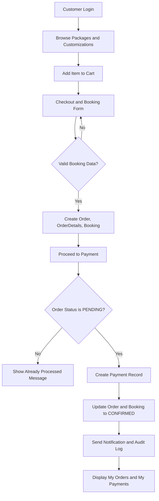

### 3.15.2 Entity Relationship Diagram (ERD)

Figure 3.2. Entity Relationship Diagram (ERD)

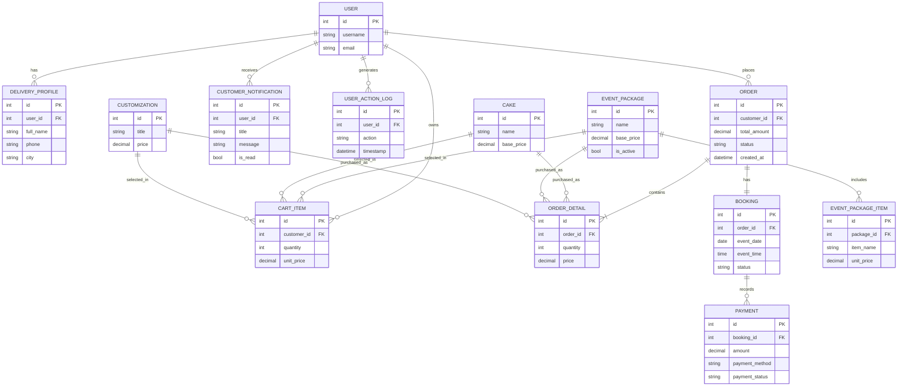

### 3.15.3 IPO Diagram (Input-Process-Output)

Figure 3.3. Input-Process-Output (IPO) Diagram

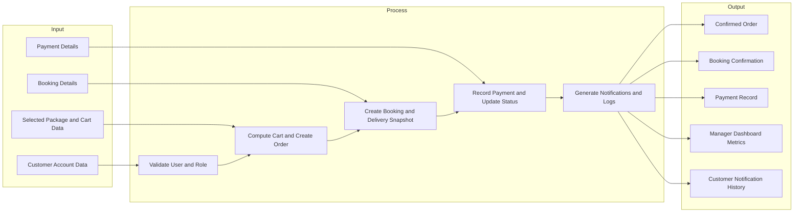

### 3.15.4 HIPO Diagram

Figure 3.4. HIPO Diagram

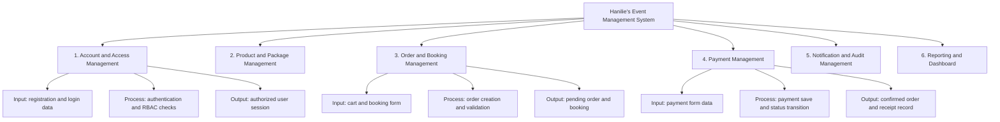

### 3.15.5 Class Diagram

Figure 3.5. Class Diagram

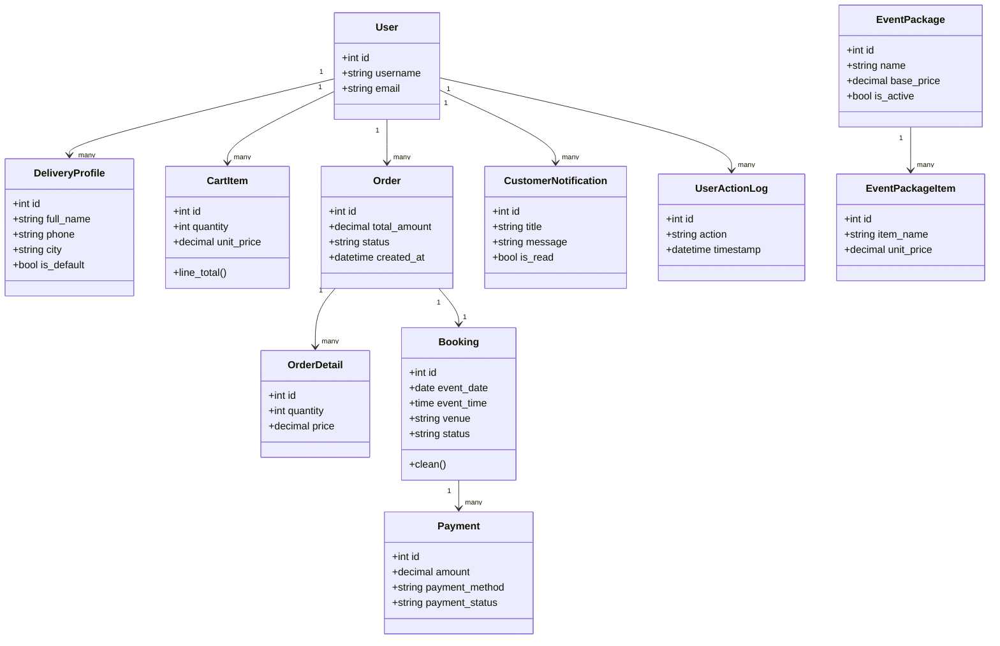

### 3.15.6 Use Case Diagram

Figure 3.6. Use Case Diagram

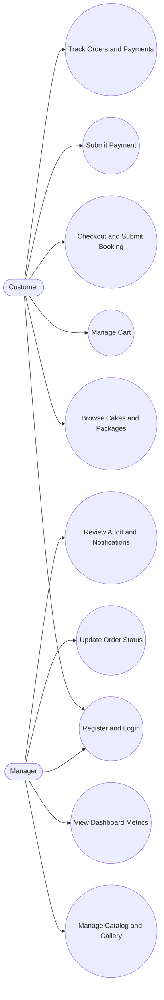

### 3.15.7 System Architecture Diagram

Figure 3.7. System Architecture Diagram

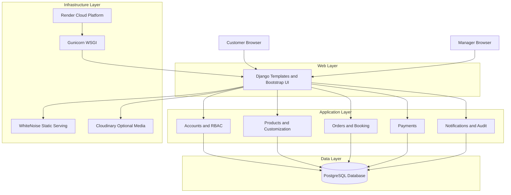

### 3.15.8 Block Diagram

Figure 3.8. System Block Diagram

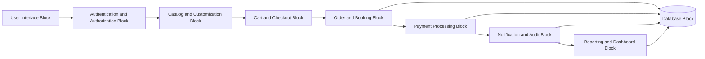

### 3.15.9 Data Flow Diagram (DFD) Level 0

Figure 3.9. Data Flow Diagram (DFD) Level 0

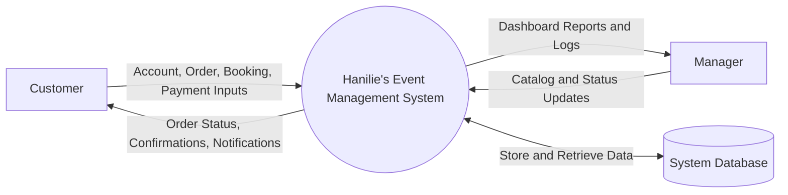

### 3.15.10 Data Flow Diagram (DFD) Level 1

Figure 3.10. Data Flow Diagram (DFD) Level 1

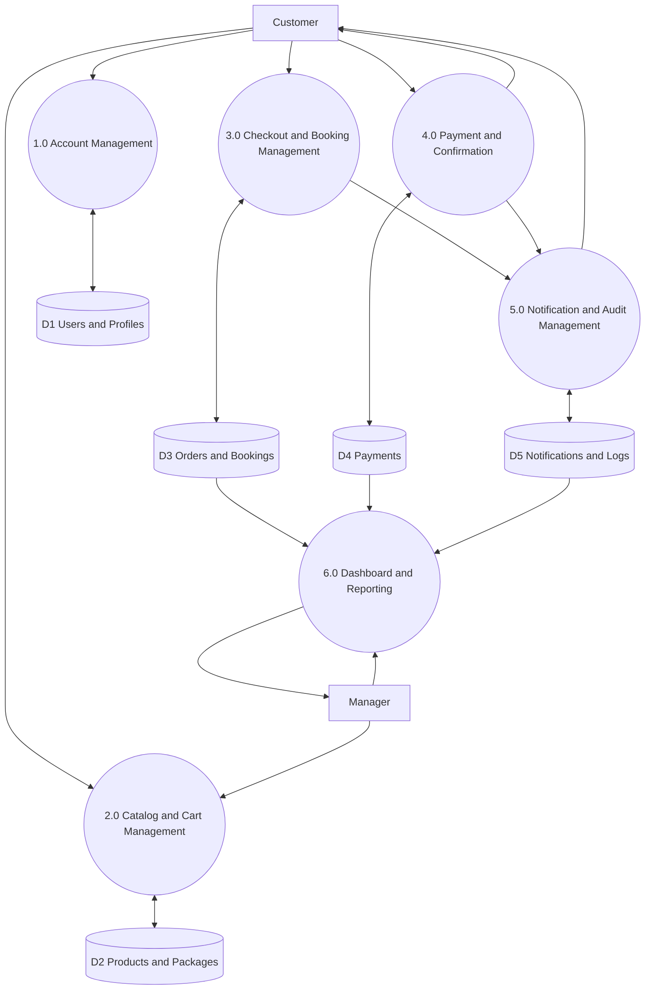

### 3.15.11 Sequence Diagram

Figure 3.11. Sequence Diagram for Checkout-to-Payment Confirmation

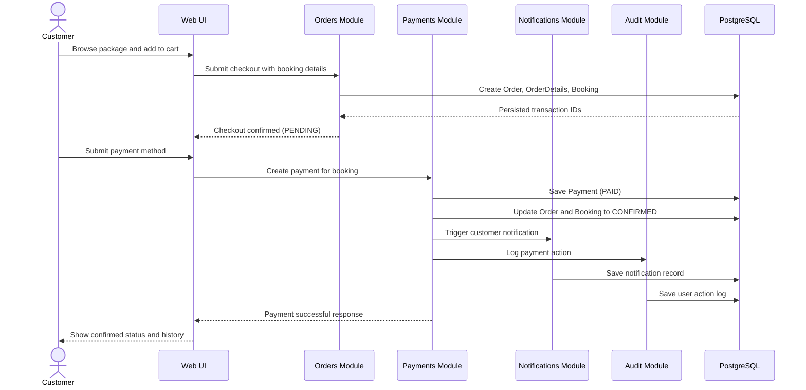

---

# REFERENCES (IEEE STYLE)

[1] I. Sommerville, Software Engineering, 10th ed. Boston, MA, USA: Pearson, 2016.

[2] R. S. Pressman and B. R. Maxim, Software Engineering: A Practitioner's Approach, 9th ed. New York, NY, USA: McGraw-Hill Education, 2020.

[3] K. Beck et al., Manifesto for Agile Software Development, 2001. [Online]. Available: https://agilemanifesto.org/. [Accessed: Mar. 28, 2026].

[4] K. Schwaber and J. Sutherland, The Scrum Guide, 2020. [Online]. Available: https://scrumguides.org/. [Accessed: Mar. 28, 2026].

[5] Django Software Foundation, Django Documentation (Version 5.0), 2024. [Online]. Available: https://docs.djangoproject.com/en/5.0/. [Accessed: Mar. 28, 2026].

[6] The PostgreSQL Global Development Group, PostgreSQL Documentation, 2026. [Online]. Available: https://www.postgresql.org/docs/. [Accessed: Mar. 28, 2026].

[7] The Bootstrap Team, Bootstrap Documentation, 2026. [Online]. Available: https://getbootstrap.com/docs/. [Accessed: Mar. 28, 2026].

[8] R. Sandhu, E. Coyne, H. Feinstein, and C. Youman, "Role-based access control models," Computer, vol. 29, no. 2, pp. 38-47, Feb. 1996.

[9] OWASP Foundation, OWASP Top 10: The Ten Most Critical Web Application Security Risks, 2021. [Online]. Available: https://owasp.org/www-project-top-ten/. [Accessed: Mar. 28, 2026].

[10] ISO/IEC 25010:2011, Systems and software engineering - Systems and software Quality Requirements and Evaluation (SQuaRE) - System and software quality models, 2011.

[11] IEEE Std 29148-2018, IEEE Standard for Systems and Software Engineering - Life Cycle Processes - Requirements Engineering. New York, NY, USA: IEEE, 2018.

[12] Render, "Deploy a Django App," Render Documentation, 2026. [Online]. Available: https://render.com/docs/deploy-django. [Accessed: Mar. 28, 2026].

[13] Gunicorn Developers, Gunicorn Documentation, 2026. [Online]. Available: https://docs.gunicorn.org/. [Accessed: Mar. 28, 2026].

[14] J. W. Creswell and J. D. Creswell, Research Design: Qualitative, Quantitative, and Mixed Methods Approaches, 5th ed. Thousand Oaks, CA, USA: SAGE Publications, 2018.
